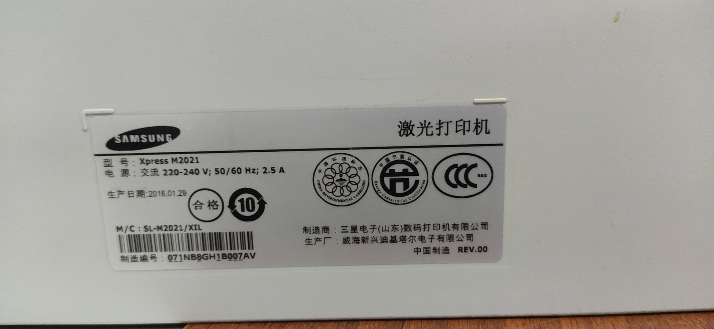
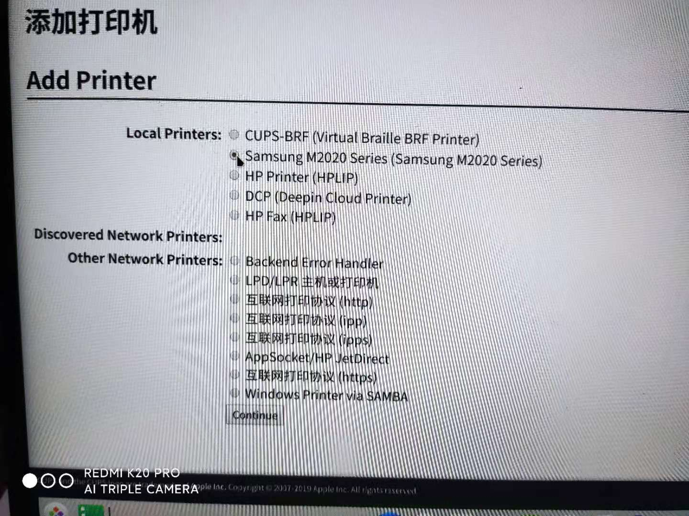
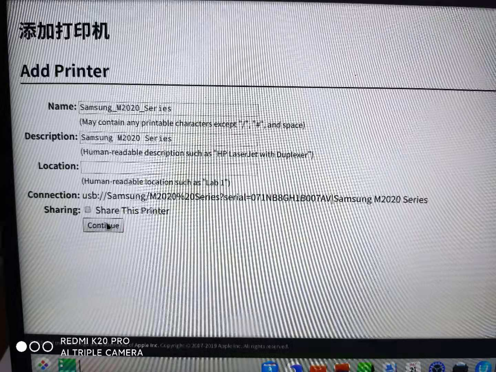
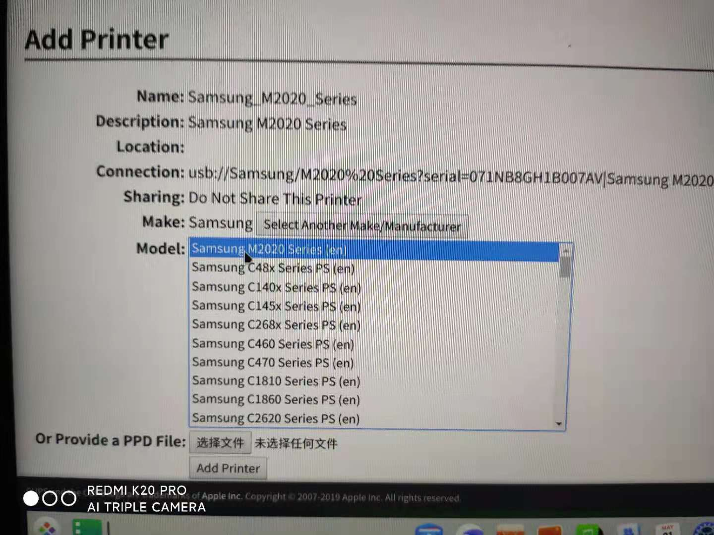

 
 # 如何在UOS系统中安装三星Xpress M2021打印机



## 前提条件

1. UOS操作系统版本及版本号：专业版1031 20
1. 计算机型号和架构：长城UF712 arm64
1. M2021打印机驱动文件：
   - https://gitlab.com/ScumCoder/splix/tree/patches/splix
   - https://github.com/nu774/jbigkit.git

## 操作步骤

1. 安装编译驱动文件。在终端执行如下命令，

   ```
   sudo apt-get install git build-essential
   git clone https://gitlab.com/ScumCoder/splix.git
   git clone https://github.com/nu774/jbigkit.git
   cd jbigkit && cp Makefile.original Makefile && make
   cd libjbig && cp libjbig85.a /usr/lib && cd ../..
   cd splix/splix && make && sudo make install
   ```

2. 将 ppd 文件拷贝到CUPS模块下。在终端执行如下命令，

   ``` 
   sudo cp ppd/m2020.ppd /usr/share/cups/model/

   ```
3. 在CUPS管理控制台（localhost:631）添加识别出的打印M2020打印机和打印驱动。
   
   
   
   
4. 测试打印。