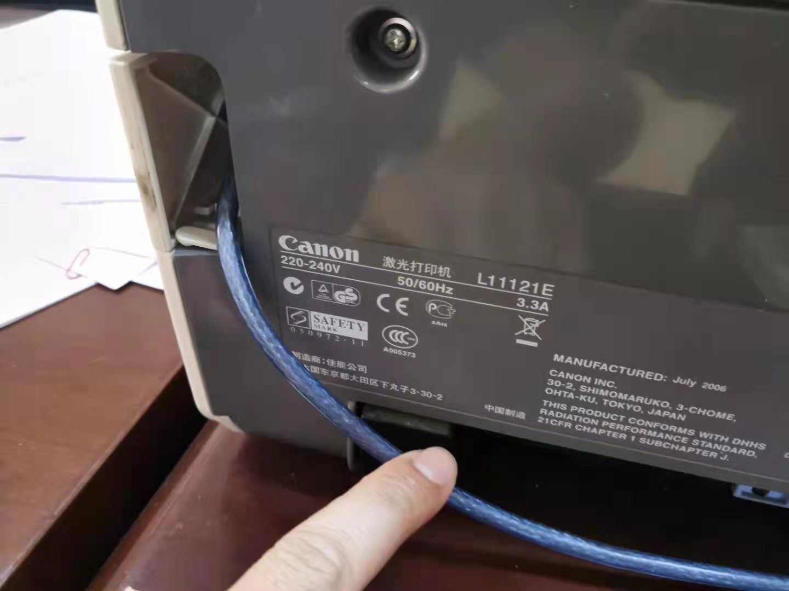
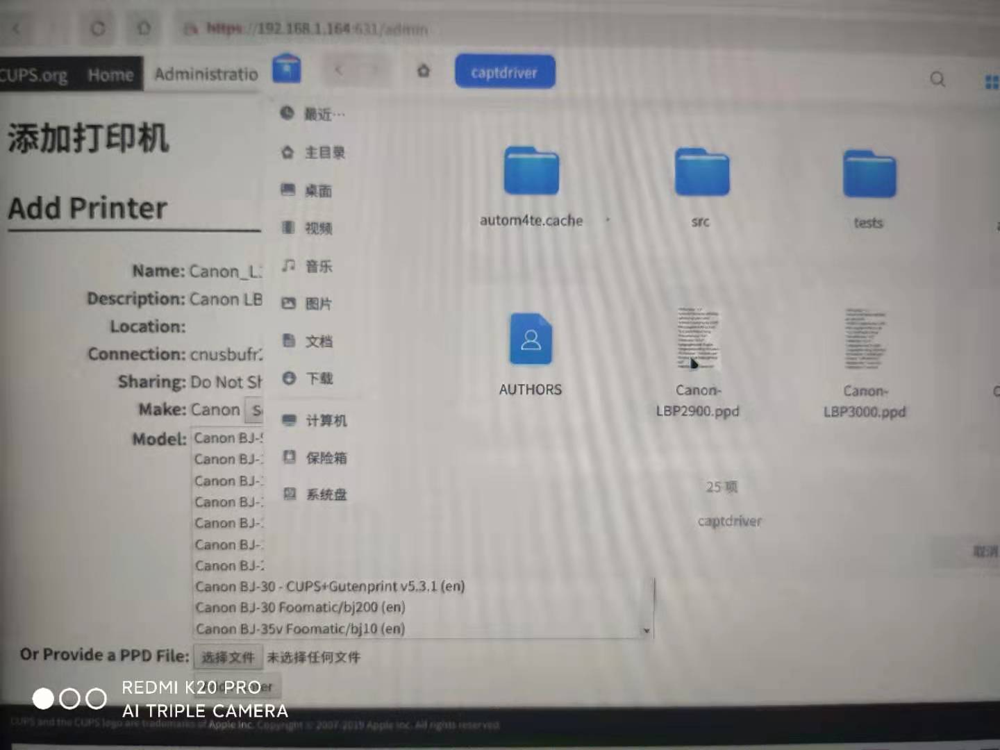
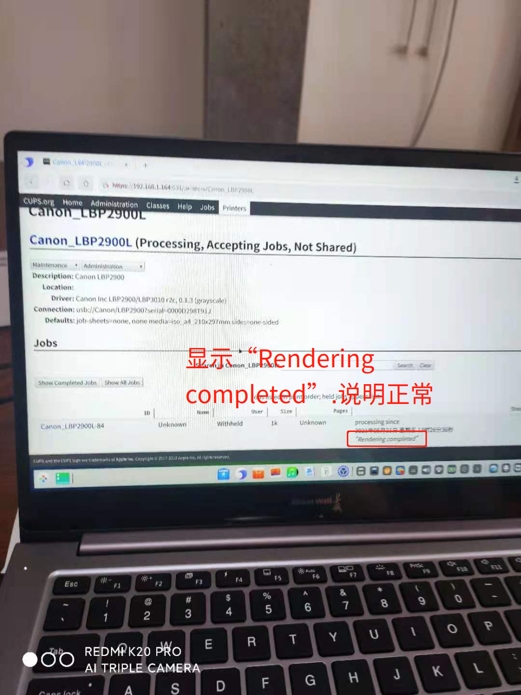

 
 # 如何在UOS系统中安装佳能L11121E打印机-arm64



## 前提条件

1. UOS操作系统版本及版本号：专业版1031 20
1. 计算机型号和架构：长城UF712 arm64
1. L11121E打印机驱动： https://github.com/agalakhov/captdriver.git

## 操作步骤

1. 下载并安装打印机驱动。按住Ctrl+ Alt+T，在终端中输入如下命令。

```
sudo apt-get install build-essential git autoconf libtool libcups2-dev libcupsimage2-dev
git clone https://github.com/agalakhov/captdriver.git
cd captdriver
autoreconf -i
./configure
make
sudo cp src/rastertocapt /usr/lib/cups/filter/
```
2. 将打印机USB线接入电脑。
3. 浏览器中输入http://本机IP或localhost:631。注意有时会提示输入用户名密码，请输入计算机用户名和密码。
4. 添加打印机，上传ppd文件。







5. 打印一张纸进行测试。
