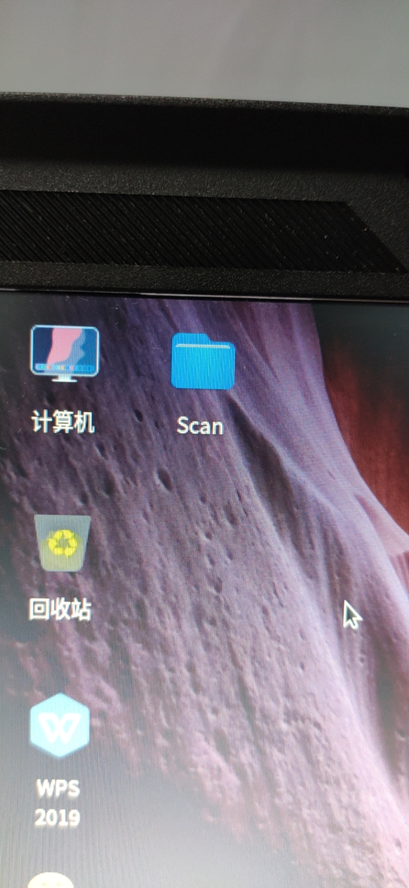
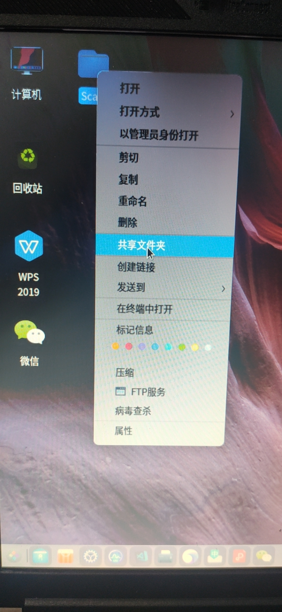
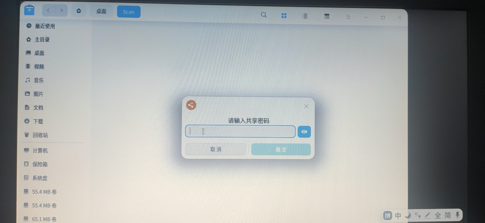
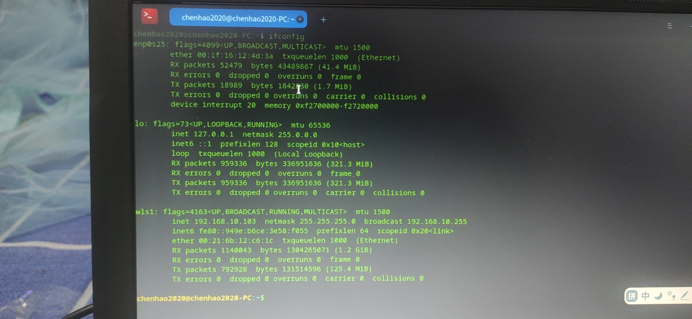
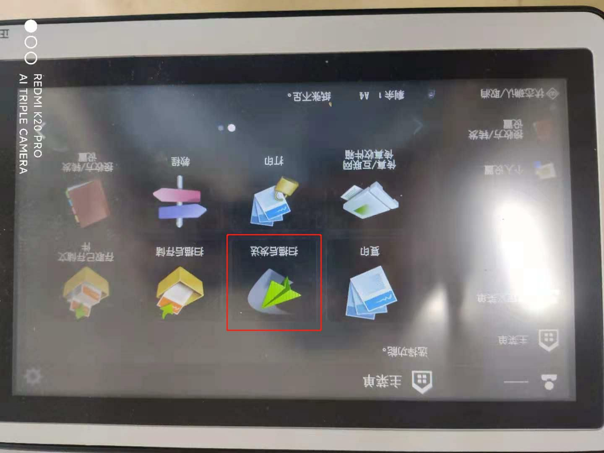
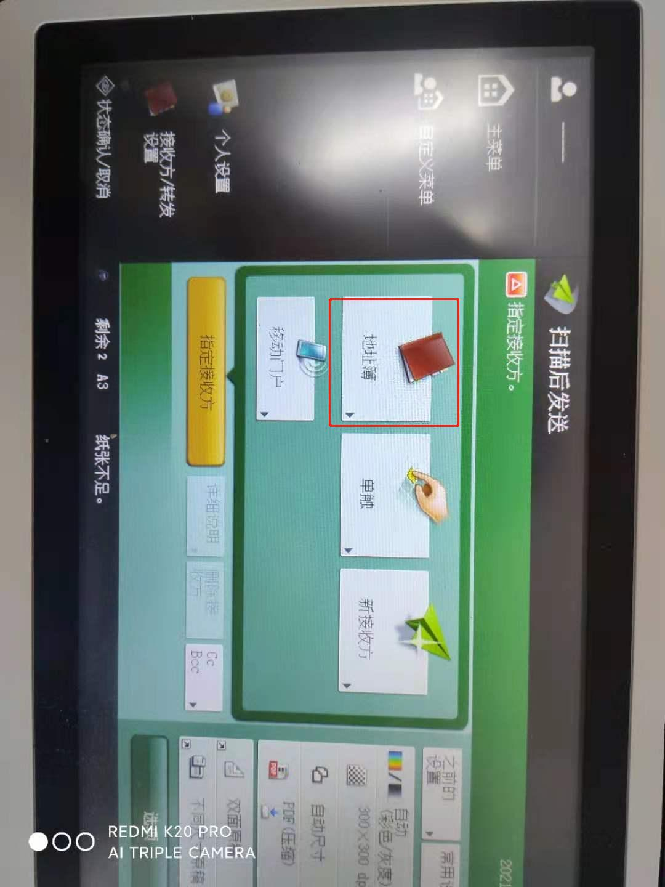
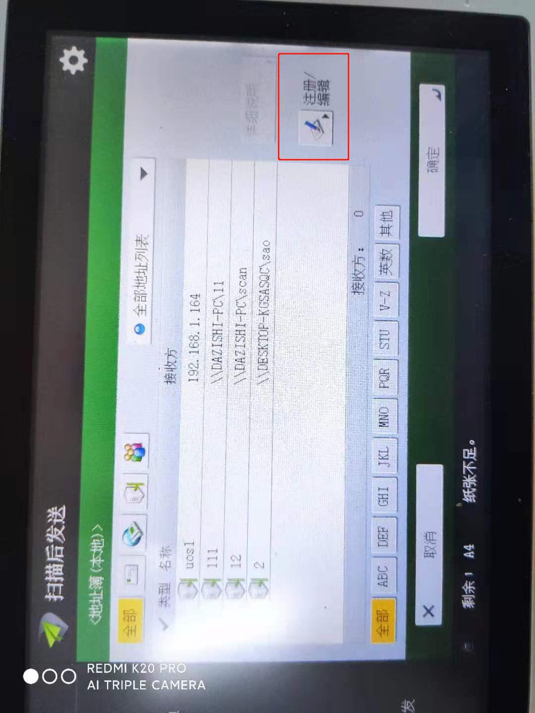
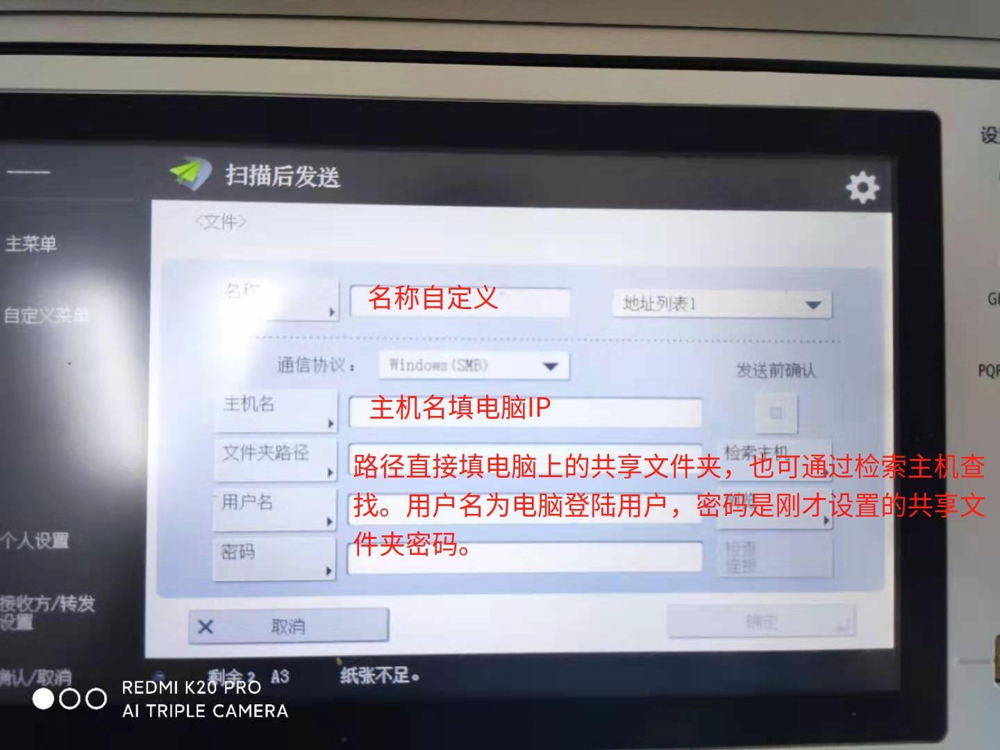
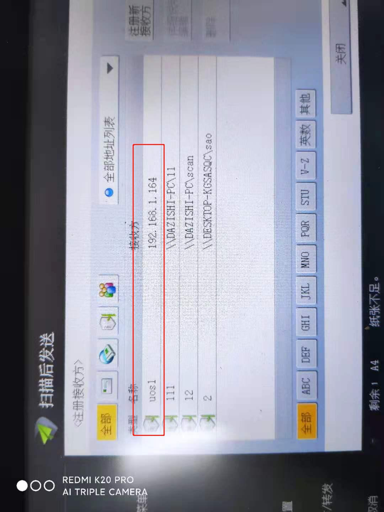

 
 # 如何将佳能C3120L一体机扫描的文件发送至UOS系统

## 前提条件

1. UOS操作系统架构及版本：专业版1031
1. 计算机型号和架构：长城UF712 arm64
2. 使用的文件分享协议：Samba

## 操作步骤

1. 在UOS操作系统中创建Samba共享文件夹。

   
2. 进入文件夹内设置Smaba共享文件夹密码。注意：Samba用户名为电脑登陆用户的用户名。

3. 查找并记住UOS电脑IP。注意：建议将电脑IP设置为静态IP，IP经常发生变化。

4. 在打印一体机上添加文件发送路径。

5. 扫描测试，将文件发送至文件夹。

